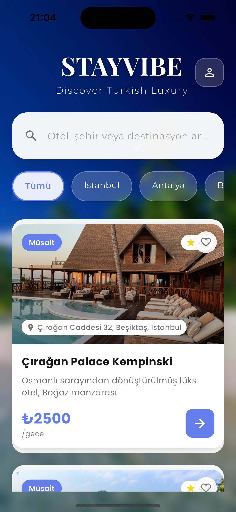
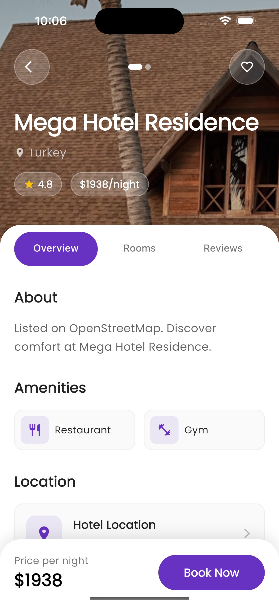
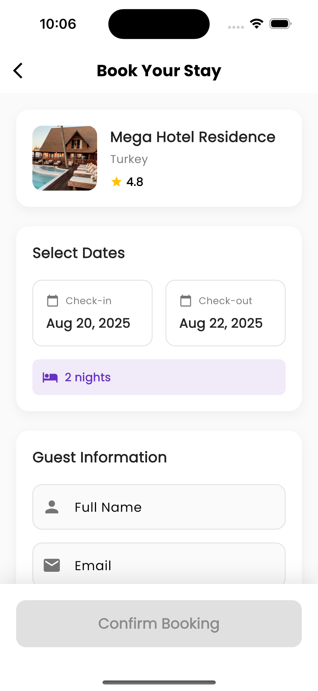

# 🏨 StayVibe - Discover Turkish Luxury Hotels

<div align="center">


**Experience the finest luxury hotels across Turkey with our cutting-edge Flutter app**

[](https://flutter.dev/)
[](https://dart.dev/)
[](LICENSE)
[](https://flutter.dev/)

[Features](#-features) • [Screenshots](#-screenshots) • [Installation](#-installation) • [Architecture](#-architecture) • [API](#-api) • [Contributing](#-contributing)

</div>

---

## ✨ Features

### 🎯 Core Features
- **🏨 Luxury Hotel Discovery** - Explore premium Turkish hotels like Çırağan Palace Kempinski
- **🔍 Smart Search & Filtering** - Search by hotel name, city, or destination with Turkish language support
- **⭐ Real-time Reviews & Ratings** - Authentic guest experiences with star ratings
- **📱 Cross-Platform** - Seamless experience on iOS, Android, and Web
- **🌍 Location Services** - GPS-based hotel recommendations with detailed addresses
- **💳 Booking Management** - Complete booking flow with availability status
- **❤️ Favorites System** - Save and manage your preferred hotels with heart icons
- **📊 Weather Integration** - Real-time weather data for better travel planning
- **🏖️ Turkish Destinations** - Focus on premium locations like İstanbul, Antalya, and more

### 🎨 UI/UX Excellence
- **Material Design 3** - Modern, intuitive interface with Turkish localization
- **Smooth Animations** - Flutter Staggered Animations for premium feel
- **Tropical Theme** - Beautiful beach backgrounds and luxury aesthetics
- **Responsive Design** - Optimized for all screen sizes
- **Loading States** - Shimmer effects and skeleton screens
- **Error Handling** - Graceful error states with retry options
- **Turkish Language Support** - Full localization with Turkish text and currency (₺)

### 🚀 Technical Features
- **State Management** - Provider pattern for efficient state handling
- **API Integration** - RESTful API with proper error handling
- **Caching** - Image caching and data persistence
- **Offline Support** - Basic offline functionality
- **Performance** - Optimized for smooth 60fps experience
- **Location Services** - Integration with geolocation and geocoding

---

## 📱 Screenshots

<div align="center">

| Splash | Home | Book Now | Confirm Booking |
|:---:|:---:|:---:|:---:|
|  |  |  |  |

</div>

---

## 🛠 Installation

### Prerequisites
- **Flutter SDK** (3.16.0 or higher)
- **Dart SDK** (3.0.0 or higher)
- **Android Studio** / **VS Code** with Flutter extensions
- **iOS Simulator** (for iOS development)
- **Android Emulator** (for Android development)

### Quick Start

1. **Clone the repository**
   ```bash
   git clone https://github.com/tahsinmert/StayVibe---Discover-Turkish-Luxury-Hotels-iOS-App.git
   cd StayVibe---Discover-Turkish-Luxury-Hotels-iOS-App
   ```

2. **Install dependencies**
   ```bash
   flutter pub get
   ```

3. **Run the app**
   ```bash
   # For iOS
   flutter run -d ios
   
   # For Android
   flutter run -d android
   
   # For Web
   flutter run -d chrome
   ```

### Build for Production

```bash
# iOS
flutter build ios --release

# Android
flutter build apk --release

# Web
flutter build web --release
```

---

## 🏗 Architecture

StayVibe follows a clean, scalable architecture pattern:

```
lib/
├── bloc/                 # Business Logic Components
│   └── hotel_bloc.dart
├── commons/             # Shared utilities and constants
│   ├── app_constants.dart
│   └── theme.dart
├── data/               # Data layer
│   ├── network/        # API services
│   └── repository/     # Data repositories
├── model/              # Data models
│   ├── hotel_model.dart
│   └── weather_model.dart
├── services/           # External services
│   └── weather_service.dart
├── ui/                 # User Interface
│   ├── pages/          # Screen pages
│   ├── utils/          # UI utilities
│   └── widgets/        # Reusable widgets
└── main.dart           # App entry point
```

### Key Design Patterns
- **Provider Pattern** - State management
- **Repository Pattern** - Data abstraction
- **BLoC Pattern** - Business logic separation
- **Service Layer** - External API integration

---

## 🔌 API Integration

StayVibe integrates with multiple APIs for comprehensive hotel data:

### Hotel Data Sources
- **OpenStreetMap API** - Location and mapping data
- **Custom Hotel API** - Luxury hotel information
- **Weather API** - Real-time weather conditions
- **Turkish Hotels Database** - Local hotel information

### API Endpoints
```dart
// Hotel endpoints
GET /hotels - Fetch all hotels
GET /hotels/{id} - Get hotel details
GET /hotels/search - Search hotels

// Weather endpoints
GET /weather/{location} - Get weather data

// Location endpoints
GET /geocode/{address} - Geocoding services
```

---

## 🎨 Customization

### Theme Configuration
The app uses a customizable theme system in `lib/commons/theme.dart`:

```dart
// Primary colors
Color primaryColor = Color(0xFF1A1A1A);
Color accentColor = Color(0xFF007AFF);

// Custom fonts
FontFamily: GoogleFonts.poppins().fontFamily

// Turkish localization
Locale('tr', 'TR') - Turkish language support
```

### Adding New Features
1. Create new models in `lib/model/`
2. Add API services in `lib/data/network/`
3. Implement UI components in `lib/ui/`
4. Update state management in `lib/bloc/`

---

## 🏖️ Turkish Luxury Hotels

StayVibe specializes in premium Turkish hospitality:

### Featured Destinations
- **İstanbul** - Historic luxury with Bosphorus views
- **Antalya** - Mediterranean coastal resorts
- **Cappadocia** - Unique cave hotels
- **Bodrum** - Aegean Sea luxury
- **Fethiye** - Turquoise Coast elegance

### Hotel Categories
- **🏰 Palace Hotels** - Ottoman heritage luxury
- **🏖️ Beach Resorts** - Coastal paradise
- **🏔️ Mountain Retreats** - Natural beauty
- **🏛️ Historic Hotels** - Cultural experiences

---

## 📊 Performance Metrics

- **App Size**: ~25MB (iOS) / ~15MB (Android)
- **Startup Time**: <2 seconds
- **Memory Usage**: <100MB average
- **Battery Impact**: Minimal background processing
- **Image Loading**: Optimized with caching
- **Search Response**: <500ms average

---

## 🤝 Contributing

We welcome contributions! Please follow these steps:

1. **Fork the repository**
2. **Create a feature branch**
   ```bash
   git checkout -b feature/amazing-feature
   ```
3. **Commit your changes**
   ```bash
   git commit -m 'Add amazing feature'
   ```
4. **Push to the branch**
   ```bash
   git push origin feature/amazing-feature
   ```
5. **Open a Pull Request**

### Development Guidelines
- Follow Flutter best practices
- Write clean, documented code
- Add tests for new features
- Maintain consistent code style
- Support Turkish localization

---

## 📄 License

This project is licensed under the MIT License - see the [LICENSE](LICENSE) file for details.

---

## 🙏 Acknowledgments

- **Flutter Team** - For the amazing framework
- **Material Design** - For design guidelines
- **Turkish Tourism** - For inspiration and hotel data
- **Open Source Community** - For various packages
- **Çırağan Palace Kempinski** - Featured luxury hotel

---

## 📞 Support

- **Email**: support@stayvibe.com
- **Website**: [stayvibe.com](https://stayvibe.com)
- **Documentation**: [docs.stayvibe.com](https://docs.stayvibe.com)
- **Turkish Support**: Türkçe destek mevcut

---

<div align="center">

**Made with ❤️ in Turkey**

[](https://github.com/tahsinmert/StayVibe---Discover-Turkish-Luxury-Hotels-iOS-App)
[](https://github.com/tahsinmert/StayVibe---Discover-Turkish-Luxury-Hotels-iOS-App)

</div>

## 👥 Contributors

- tahsin mert mutlu ([@tahsinmert](https://github.com/tahsinmert))

---

